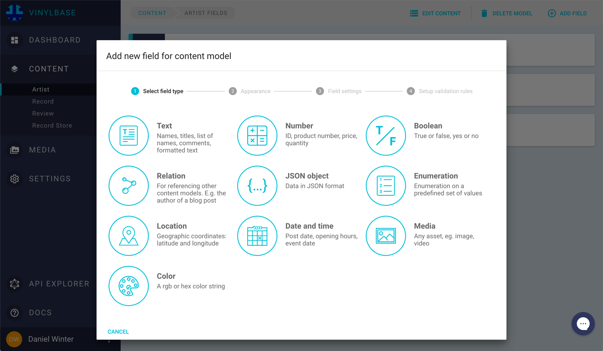
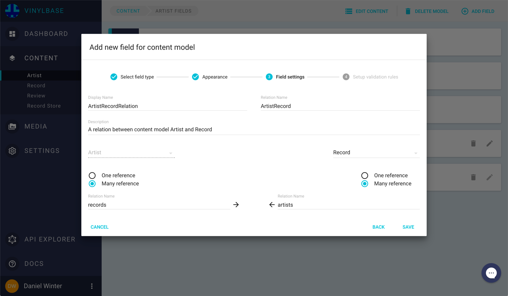

# Getting Started
GraphCMSでコンテンツAPIを構築するのは簡単です！この入門ガイドでは、音楽ブログ用のコンテンツAPIをすばやく作成する方法を紹介します。

## Creating a Project
まず、`Vinylbase`と呼ばれる新しいプロジェクトを作成します。

> プロジェクト名には、英数字と空白のみを使用できます。

## Creating Content Models
プロジェクトを作成した後、`CONTENT`ビューに切り替え、`ADD MODEL`ボタンを使用して次のモデルを追加します。

- `Artist`
- `Record`
- `Review`
- `Record Store`

> モデルのAPI IDは大文字で始まり、英数字のみを使用できます。空白は許されません。

## Adding Fields to your Content Models
コンテンツモデルにコンテンツを取り込む前に、それらにフィールドを追加する必要があります。これは、サイドバーのコンテンツモデルの横にある小さな歯車のアイコンをクリックするか、コンテンツモデルをクリックしてから、`EDIT FIELDS`ボタンをクリックして行います。

そうすると、`Field Wizard`が開きます。ここでは、コンテンツモデルに追加するフィールドのタイプ、外観、API識別子、および追加ルールを指定できます。

## Fields for model Artist
コンテンツモデル`Artist`の場合は、次の3つのフィールドを追加します。

- `Name`
- `Pictures`
- `Records`

`Name`については、`required`に応じて設定した`Single Line Text Field`を使用します。`Display Name`を使用すると、Webインターフェイスでフィールドをどのように表示するかを定義し、`API ID`でContent APIでフィールドの名前を指定する方法を定義します。

> ウェブインターフェースでは、API IDの先頭に＃が付いています（例：#name）。
> フィールドのAPI IDは小文字で始まり、英数字のみを使用できます。

フィールド`Pictures`では、アセットフィールドを追加して`Allow multiple values`をチェックします。これにより、任意の数のメディアファイルを保存できます。

このモデルに関係を追加します。 Relationsでは、2つのコンテンツモデルを接続できます。この場合、アーティストと既存のレコードを結びつけたいので、`ArtistRecord Relation`を作成します。リレーション名は、リレーションシップがコンテンツAPIでどのように指定されるかを定義します。

`Artist`は多くの`#records`を持つことができるように関係を設定しますが、反対に`Record`は`#artists`を多数持つこともできます。
 > 関係名は大文字で始まり、英数字のみを使用できます

 モデルに添付されているすべてのフィールドが表示されるようになりました。

> `ID`、`CreatedAt`、および`UpdatedAt`の3つの追加フィールドがあることに注意してください。これらはシステムフィールドであり、削除または変更することはできません。
> フィールドの順序を変更するには、左側のアイコンの項目をドラッグします。ここで定義する設定は、このコンテンツモデルのエントリを作成または編集できるエントリフォーム内の同じ順序です。

## Fields for model Record
このモデルは、音楽レコードのコンテンツを格納します。フィールドは次のようになります。

- Title `#title` `Single Line Text` `required`
- Tracklist `#tracklist` `Single Line Text` `Allow multiple values`
- Cover `#cover` `Asset`

このモデルのAPI ID `#artists`との関係フィールドに気付いた？このフィールドエントリは、前に作成した`ArtistRecord Relation`の`reverse side`にあるためです。 GraphQLコンテンツAPIを構築しているので、両方向にトラバースできる必要があります。